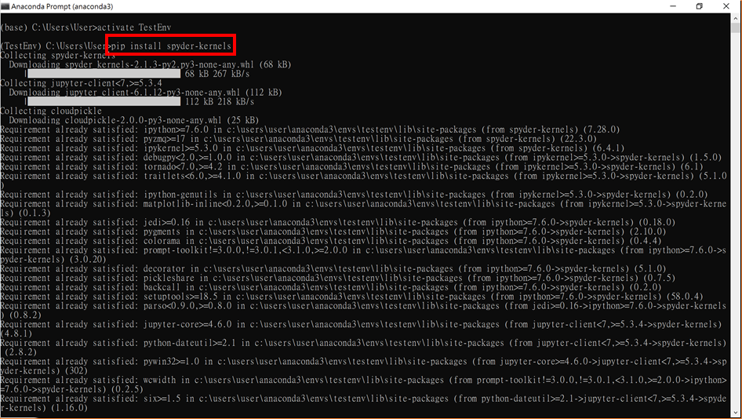

# 如何在 Python IDE 中使用不同虛擬環境(Virtual Env) 的 Kernel

- ### Step 1 : 開啟 Anaconda Prompt(anaconda3)  
  > 【開始】&rarr; 以系統管理員身分執行【Anaconda Prompt(anaconda3)】 
  
  
- ### Step 2 : 創建新的虛擬環境  
  ```console
  conda create --name 虛擬環境名稱 python=3.9
  ```
  
  
- ### Step 3 : 啟動虛擬環境   
  ```console
  activate 虛擬環境名稱
  ```
  
  
- ### Step 4 : 安裝套件    
  ```console
  pip install -r requirements.txt
  # 註: 須安裝 ipykernel
  ```
  
  
- ### Step 5 : 建立連結到虛擬環境的 Kernel   
  - Jupyter Notebook/Lab with ipykernel
    ```console
    python -m ipykernel install --user --name=Kernel名稱
    ```
     
  
  - Spyder
    ```console  
    pip install spyder-kernels
    ```
     
  
- ### Step 6 : 離開虛擬環境   
  ```console
  conda deactivate
  ```
      

- ### Step 7 : 驗證 Kernel 是否在 IDE(Integrated Development Environment) 中   
  - Jupyter Notebook  
        
  
  - Jupyter Lab  
       
  
  - Spyder    
    【Tools】 &rarr; 【Preferences】 &rarr; 【Python interpreter】
     

- ### Step 8 : 移除虛擬環境的 Kernel   
  - Jupyter Notebook / Lab   
  ```console  
  jupyter kernelspec remove Kernel名稱
  ```   
